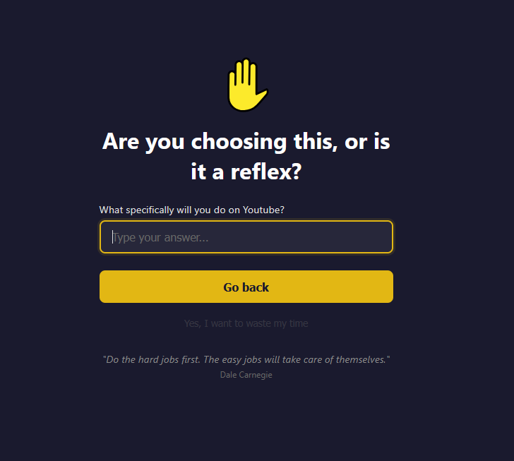

#  Don't Procrastinate

A Firefox extension that adds a confirmation step before opening distracting websites.

## Features

- **Site Blocking**: Create a blocklist of distracting sites with support for path-based patterns (e.g. `youtube.com/shorts/`)
- **Interstitial Page**: Forces a pause before visiting blocked sites with a configurable wait timer
- **Daily Limits**: Set per-site limits on opens per day and minutes per day
- **Intent Declaration**: Require typing what you plan to do before proceeding
- **Dynamic Toolbar Icon**: Shows a sad face when you're on a blocked site

Icons from [OpenMoji](https://openmoji.org/) under [CC BY-SA 4.0](https://creativecommons.org/licenses/by-sa/4.0/).
